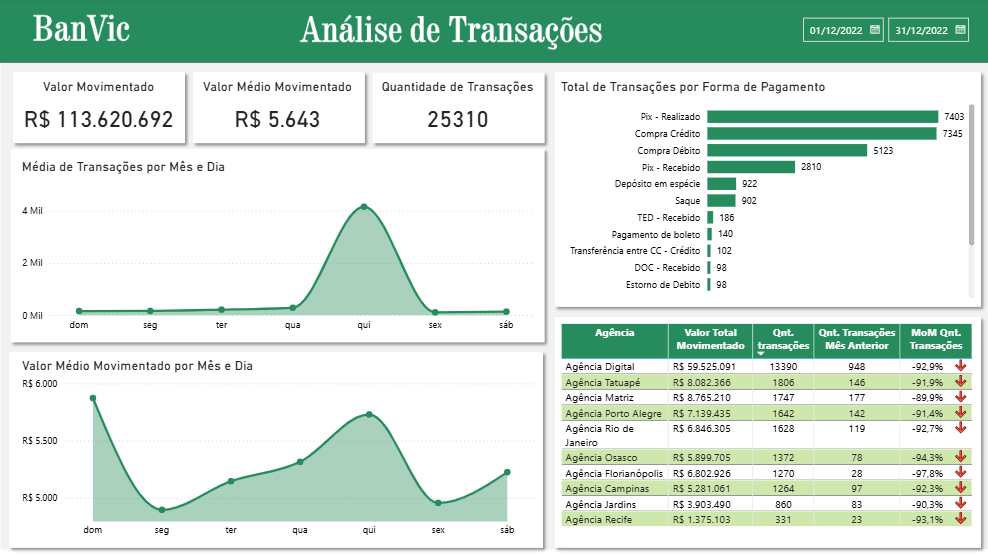
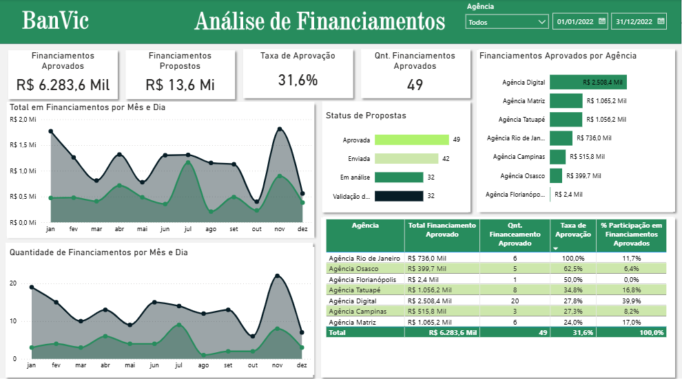

# Banco Vitoria - Analise de Dados

[](https://www.python.org/)
[](https://pandas.pydata.org/)
[](https://matplotlib.org/)
[](https://seaborn.pydata.org/)
[](https://powerbi.microsoft.com/)

Análise exploratória de dados (EDA) e desenvolvimento de dashboard para visualização de insights do **Banco Vitória S.A. (Banvic)** — banco fictício utilizado como estudo de caso.

---

## Descrição

O **Banco Vitória S.A. (BanVic)** surgiu em 2010 com a proposta de oferecer serviços bancários por meio de agências físicas e no ambiente digital, prezando o foco no cliente e na transparência. Observando as tendências no mundo financeiro, a implementação da **cultura Data Driven** tem se mostrado um fator decisivo para melhoria dos serviços prestados e da geração de valor ao cliente através da análise de seus dados.

Este projeto piloto tem como objetivo demonstrar como a análise de dados pode ser um diferencial competitivo e como a adoção de uma cultura orientada a dados pode transformar a instituição em termos estratégicos.

### Etapas do Projeto

1. **Análise Exploratória de Dados (EDA)** — Notebook em Python que realiza limpeza, tratamento e visualização dos dados brutos do banco, exportando tabelas processadas para uso no dashboard.

2. **Dashboard Power BI** — Relatório interativo com modelo semântico (star schema) que permite explorar métricas de agências, clientes, contas, transações e propostas de crédito do Banvic.

---

## Estrutura do Projeto

```
projeto-banvic-dataviz/
├── banvic_dados/               # Dados brutos (CSV)
│   ├── agencias.csv
│   ├── clientes.csv
│   ├── colaborador_agencia.csv
│   ├── colaboradores.csv
│   ├── contas.csv
│   ├── propostas_credito.csv
│   └── transacoes.csv
├── dashboard/                  # Power BI Desktop (formato .pbip)
│   ├── Dashboard_banvic.pbip
│   ├── Dashboard_banvic.Report/
│   └── Dashboard_banvic.SemanticModel/
├── EDA_Banvic.ipynb            # Notebook de análise exploratória
├── requirements.txt            # Dependências Python
├── .gitignore
└── README.md
```

---

## Dados

O dataset é composto por 7 tabelas com dados do banco fictício Banvic, abrangendo transações financeiras, propostas de financiamento, agências, colaboradores e clientes.


### Tabelas

| Tabela | Descrição |
|--------|-----------|
| **agencias** | Dados das agências (Física/Digital) |
| **clientes** | Dados dos clientes |
| **colaborador_agencia** | Tabela de junção colaborador ↔ agência |
| **colaboradores** | Dados dos funcionários do banco |
| **contas** | Contas com saldos e datas |
| **propostas_credito** | Propostas de financiamento com status |
| **transacoes** | Transações (Crédito/Débito/Transferência/Depósito) |

---

## Analise Exploratoria (EDA)

O notebook `EDA_Banvic.ipynb` realiza as seguintes etapas para cada tabela:

### Tratamento dos Dados

- Verificação de tipos e estrutura (`info()`, `describe()`)
- Verificação de duplicatas
- Tratamento de valores nulos e linhas repetidas
-  Conversão de colunas de data para `datetime`

### Visualizações Geradas
| Tabela | Visualizações |
|--------|--------------|
| agencias | Distribuição por tipo (Física/Digital) e por cidade |
| clientes | Distribuição por tipo de cliente (PF/PJ) |
| contas | Histograma e boxplot de saldo total |
| propostas_credito | Boxplots de valores financiados e propostos |
| transacoes | Contagem de transações por tipo |

### Visão Geral

| Métrica | Valor |
|---------|-------|
| Total de Agências | 10 (9 físicas, 1 digital) |
| Total de Clientes | 998 (todos Pessoa Física) |
| Total de Contas | ~999 |
| Período dos Dados | 01/01/2010 até 15/01/2023 |

### Distribuição de Agências por Cidade

| Cidade | Quantidade |
|--------|------------|
| São Paulo - SP | 4 |
| Campinas - SP | 1 |
| Osasco - SP | 1 |
| Porto Alegre - RS | 1 |
| Rio de Janeiro - RJ | 1 |
| Florianópolis - MG | 1 |
| Recife - PE | 1 |

### Estatísticas de Saldos

- **75% das contas** possuem saldo total de até **R$35.410**
- **Média de saldo**: R$11.668
- **Desvio padrão**: R$41.872 (alta dispersão devido a outliers)
- **Saldo máximo**: R$419.923

### Exportação
Ao final, o notebook exporta todas as tabelas tratadas para a pasta `banvic_limpo/` em formato CSV, que são utilizadas como fonte de dados do dashboard Power BI.

---

## Principais Insights e Respostas de Negócio

### Métodos de Pagamento
- Cartão de crédito, cartão de débito e Pix lideram o volume de transações
- Forte preferência dos clientes por esses meios de pagamento

### Transações por Dia da Semana
- **Maior média de transações**: Quinta-feira (média de 40 transações)
- **Maior volume médio movimentado**: Terça-feira (R$6.135,77 em média)

### Propostas de Financiamento
- **50% das propostas**: até R$81.968
- **50% dos valores propostos que seguem para outras etapas**: até R$126.781
- **75% dos financiamentos propostos**: até R$123.508
- **75% dos valores efetivados**: até R$187.196

### Performance por Agência (Últimos 6 meses)
- **3 melhores** (quantidade de transações): Digital, Matriz e Tatuapé
- **3 piores** (quantidade de transações): Florianópolis, Jardins e Recife
- **Melhores MoM**: Jardins, Osasco e Rio de Janeiro
- **Piores MoM**: Florianópolis, Campinas e Recife

### Perguntas de Negócio

| Pergunta | Resposta |
|----------|----------|
| Qual dia da semana com maior média de transações? | Quinta-feira (média de 40 transações) |
| Qual dia com maior volume médio movimentado? | Terça-feira (R$6.135,77 em média) |
| Meses pares apresentam volume maior? | Nao, a hipotese foi refutada |
| Qual agencia com mais transacoes (ultimos 6 meses)? | Agencia Digital |
| Qual agencia com menos transacoes (ultimos 6 meses)? | Agencia Florianopolis |

### Indicadores Monitorados

| Categoria | Indicador |
|-----------|-----------|
| **Transacoes** | Valor Total Movimentado |
| | Valor Medio Movimentado |
| | Quantidade de Transacoes |
| | Transacoes por Mes e Dia |
| | Total de Transacoes por Forma de Pagamento |
| | MoM (Month over Month) Quantidade de Transacoes |
| **Financiamentos** | Valor de Financiamentos Aprovados |
| | Quantidade de Financiamentos Aprovados |
| | Valor de Financiamentos Propostos |
| | Taxa de Aprovacao |
| | Total em Financiamentos por Mes e Dia |
| | Financiamentos Aprovados por Agencia |
| | Participacao em Financiamentos Aprovados por Agencia |

---

## Dashboard Power BI

O dashboard foi desenvolvido no **Power BI Desktop** utilizando o formato de projeto `.pbip` (Power BI Project), com modelo semântico versionado separadamente. A escolha da ferramenta foi devida à sua facilidade de edição e acesso através do navegador, facilitando a disseminação das informações entre as partes interessadas da empresa.

### Telas do Dashboard

**Análise de Transações:**


**Análise de Financiamentos:**


### Painel 1: Análise de Transações

**Indicadores Principais:**
- Valor Movimentado
- Valor Médio Movimentado
- Quantidade de Transações

**Visualizações:**
- Séries temporais: Média de Transações por Mês e Dia
- Séries temporais: Valor Médio Movimentado por Mês e Dia
- Total de Transações por Forma de Pagamento
- Tabela resumo por agência com indicador MoM

### Painel 2: Análise de Financiamentos

**Indicadores Principais:**
- Financiamentos Aprovados (valor)
- Financiamentos Propostos (valor)
- Taxa de Aprovação
- Quantidade de Financiamentos Aprovados

**Visualizações:**
- Total em Financiamentos por Mês e Dia
- Quantidade de Financiamentos por Mês e Dia
- Propostas por estados (barras)
- Comportamento por agência

### Modelo Semântico (Star Schema)

**Tabelas de Dimensão:**
| Tabela | Descrição |
|--------|-----------|
| dim_agencias | Dados das agências (código, nome, endereço, cidade, UF, tipo, data de abertura) |
| dim_clientes | Dados dos clientes (código, nome, email, tipo, CPF/CNPJ, data de nascimento/inclusão) |
| dim_contas | Dados das contas (número, código do cliente/agência/colaborador, tipo, saldos, datas) |
| dim_colaboradores | Dados dos colaboradores (código, nome, email, CPF, data de nascimento) |

**Tabelas de Fato:**
| Tabela | Descrição |
|--------|-----------|
| fat_transacoes | Transações bancárias (código, conta, data, tipo, valor) |
| fat_propostas_credito | Propostas de financiamento (código, cliente, colaborador, valores, parcelas, carência, status) |

**Tabelas Calculadas:**
| Tabela | Descrição |
|--------|-----------|
| dCalendario | Calendário para análise temporal (Ano, Mês, Dia, Nome_mês, Nome_dia) |
| Medidas | Medidas DAX do relatório |

### Medidas DAX Principais

| Medida | Descrição |
|--------|-----------|
| Qnt. transações | Contagem distinta de transações |
| Valor Total Movimentado | Soma dos valores transacionados |
| Valor Médio Movimentado | Média dos valores transacionados |
| Total Financiamento Aprovado | Soma de financiamentos com status "Aprovada" |
| Qnt. Financeamento Aprovado | Contagem de propostas aprovadas |
| Taxa de Aprovação | Proporção de propostas aprovadas |
| Total Financiamento Proposto | Soma dos valores propostos |
| Valor Médio Proposto | Média dos valores propostos |
| Carência Média | Média de meses de carência |
| MoM Qnt. Transações | Variação mês a mês de transações |
| % Participação em Financiamentos Aprovados | Participação de cada agência no total |
| Média Transações | Média mensal de transações |


---

## Conclusão e Recomendações

### Conclusão

Todas as análises reforçam o poder que o uso inteligente dos dados gerados pelo BanVic podem proporcionar à marca e, principalmente, ao cliente. O impacto que a adoção da **cultura Data Driven** pode gerar é indiscutível, sendo um grande passo para o processo de crescimento sustentável do banco através de tomadas de decisão mais assertivas e análises cada vez mais personalizadas.

### Recomendações

1. **Estratégias de Fidelização**
   - Explorar a forte preferência por cartão de crédito, débito e Pix
   - Implementar cashback, descontos em marketplaces e programas de pontos
   - Agregar valor ao serviço prestado e atingir parcela significativa da base

2. **Gestão de Financiamentos**
   - Definir metas realistas e atingíveis para agências e colaboradores
   - Monitorar o funil de etapas para diminuir perdas
   - Identificar agências com melhor desempenho para servir de benchmark

3. **Segmentação de Clientes**
   - Estudar o perfil dos clientes para determinar clusters
   - Criar estratégias exclusivas para cada perfil
   - Engajar clientes premium com serviços especializados

4. **Implementação de Analytics**
   - Iniciar processo de implementação de ferramentas de analytics
   - Promover mudança de pensamento para instituição orientada a dados
   - Valorizar o uso correto dos dados gerados

---

## Como Rodar

### Pré-requisitos
- Python 3.11+
- [Power BI Desktop](https://powerbi.microsoft.com/) (para visualizar o dashboard)

### Configuração do Ambiente Python

```bash
# Clonar o repositório
git clone <url-do-repositorio>
cd projeto-banvic-dataviz

# Criar ambiente virtual
python -m venv venv

# Ativar o ambiente virtual
# Linux/Mac:
source venv/bin/activate
# Windows:
venv\Scripts\activate

# Instalar dependências
pip install -r requirements.txt
```

### Executar a Análise Exploratória

```bash
# Abrir o Jupyter Notebook ou VS Code com extensão de notebooks
jupyter notebook EDA_Banvic.ipynb
# ou
code EDA_Banvic.ipynb
```

### Abrir o Dashboard

Abra o arquivo `dashboard/Dashboard_banvic.pbip` no **Power BI Desktop**.

> **Nota:** O dashboard carrega dados da pasta `banvic_limpo/`. Execute primeiro o notebook EDA para gerar essa pasta com os dados tratados.

---

## Dependências

| Biblioteca | Versão | Uso |
|-----------|--------|-----|
| pandas | 2.3.3 | Manipulação e análise de dados |
| matplotlib | 3.8.0 | Criação de gráficos estáticos |
| seaborn | 0.12.2 | Visualização estatística |

---

## Tecnologias

- **Python** — Linguagem principal para análise de dados
- **Pandas** — Manipulação e transformação de DataFrames
- **Matplotlib** / **Seaborn** — Geração de gráficos e visualizações
- **Power BI Desktop** — Desenvolvimento do dashboard interativo
- **Power BI Semantic Model** — Modelo de dados com schema estrela e medidas DAX


